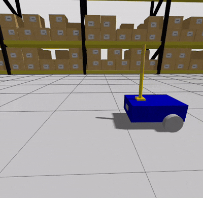

# 🤖 ROS 2 ArmCart Simulation

A ROS 2 simulation of a mobile manipulator combining a differential drive robot with a 2DOF robotic arm. Built with Gazebo sim and RViz2, controlled using teleop_twist_keyboard.

## 🌀 Demo



## 🛠️ Features
- 2DOF robotic arm + mobile base
- Differential drive base (2WD + caster wheel)
- Gazebo simulation with physics
- ROS 2 control integration
- RViz visualization
- Camera sensor plugin for perception
- Ready for future expansion (ex. MoveIt2)

## 🚀 How to Run

```bash
cd ~/armcart_ws
colcon build
source install/setup.bash

ros2 launch armcart_bringup simulation.launch.py
```

### 🔹 Mobile Base (Wheels)
Use keyboard teleoperation:`

ros2 run teleop_twist_keyboard teleop_twist_keyboard

This publishes velocity commands to /cmd_vel to move the robot.
🔹 Arm Joints

You can control each joint manually using ros2 topic pub:

### 🔹 Move Joint 0 to position 0.5
ros2 topic pub -1 /joint0/cmd_pos std_msgs/msg/Float64 "{data: 0.5}"

### 🔹 Move Joint 1 to position 1.0
ros2 topic pub -1 /joint1/cmd_pos std_msgs/msg/Float64 "{data: 1.0}"

## 📦 Requirements

    ROS2 Jazzy

    Gazebo Sim 

    robot_state_publisher, joint_state_publisher_gui

    gazebo_ros2_control
    
## 📁 Folder Structure

```
armcart_ws/
├── src/
│   ├── my_robot_bringup/
│   ├── my_robot_description/
└── images/
    └── armcart.gif
```
